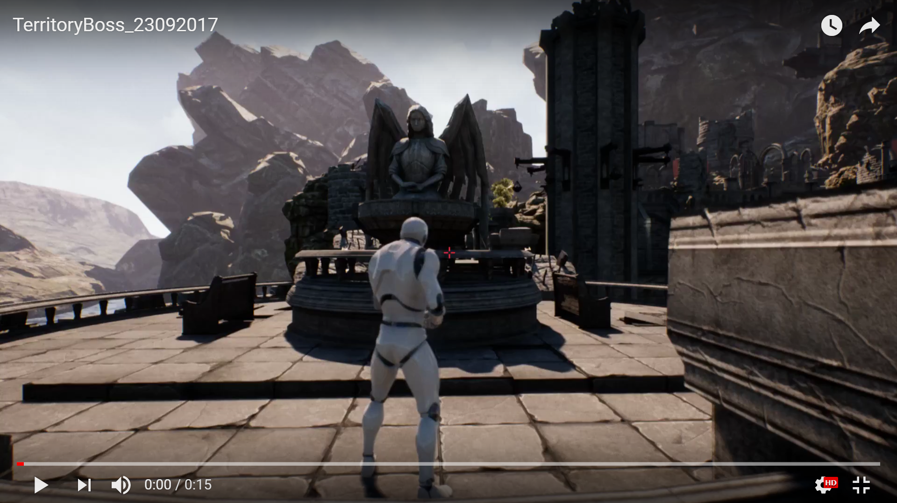

# Territory Boss
Territory Boss is an upcoming **free-to-play** multiplayer battle royal third-person shooter game

## Latest Short Demo
[](https://youtu.be/eYM2Y440_BE)

## Before you get started

It’s not recommended to immediately dive into this game development if you have no prior C++ experience. If you are completely new to Unreal Engine 4 I recommend you to read https://docs.unrealengine.com/latest/INT/GettingStarted/index.html

Required Third Party Software
---------------------

**Windows:**

Be sure to have [Visual Studio 2015](https://www.visualstudio.com/vs-2015-product-editions) installed.  You can use any desktop version of [Visual Studio 2015](https://www.visualstudio.com/), including the free version called Community 2015.

You need [DirectX End-User Runtimes (June 2010)](http://www.microsoft.com/en-us/download/details.aspx?id=8109) to avoid compilation errors.  Most users will already have this, if you have ever installed DirectX runtimes to play a game.
 
**Mac OSX:**

Be sure to have [Xcode 5.1](https://itunes.apple.com/us/app/xcode/id497799835) installed.


## Installation

- First, you'll want to install [Unreal Engine version 4.15.3](https://docs.unrealengine.com/latest/INT/GettingStarted/Installation/) for installation
- You'll want to create your own Territory Boss **fork** by clicking the __Fork button__ in the top right of this page.
- Next, [install a Git client](http://help.github.com/articles/set-up-git) on your computer.
- Now you can clone your repository to your PC (e.g: your nickname is endiliey)

  ```
  git clone https://github.com/endiliey/TerritoryBoss.git
  ```
  
- You can now open up **TerritoryBoss.uproject** from the cloned folder to open all the files
- You can easily **submit contributions** back up to your **fork**. 
- When you're ready to send the changes for review, simply create a [Pull Request](https://help.github.com/articles/using-pull-requests).
